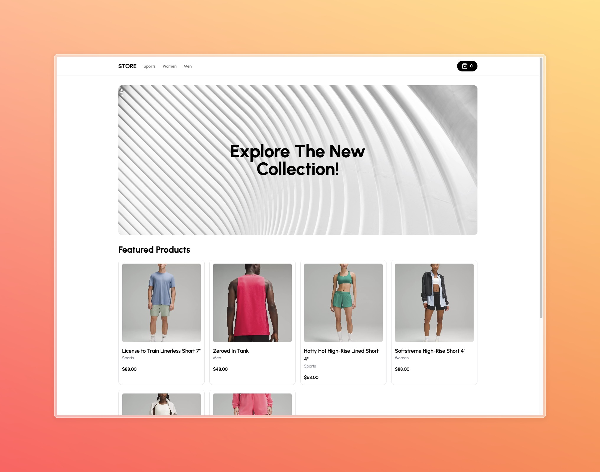

# Next.js Store Application with API Integration

This project is a Next.js application that utilizes a separate API to fetch and display product data. It is designed to work alongside with the [admin project](https://github.com/rameskum/ecommerce-admin) with Stripe integration, admin dashboard, and image upload functionality.



## Prerequisites

Node.js and npm (or yarn) installed on your system.
A Stripe account with API keys (test or live, depending on your needs)
Installation

```bash
# Clone this repository:
git clone git@github.com:rameskum/ecommerce-store.git

# Navigate to the project directory:
cd ecommerce-store

# Install dependencies:

pnpm install

# Configuration
# Create a .env.local file in the project root directory.

# Add the following environment variables to .env.local:

# store api endpoint
NEXT_PUBLIC_API_URL=http://localhost:3000/api/b351e696-8731-4aab-8c60-2f13a48c618b

# default billboard id
NEXT_PUBLIC_BILLBOARD_ID="2ba1cffc-c363-485f-b88f-cabbfa86bf34"
```

### Important Note

Do not commit the .env.local file to your version control system.

#### Development

Start the development server:

```bash
pnpm dev
```

This will start the server on <http://localhost:3000> by default.

Open <http://localhost:3000> in your browser to access the application.

#### Building for Production

Build an optimized production version of the application:

```bash
pnpm run build

pnpm run start
```
